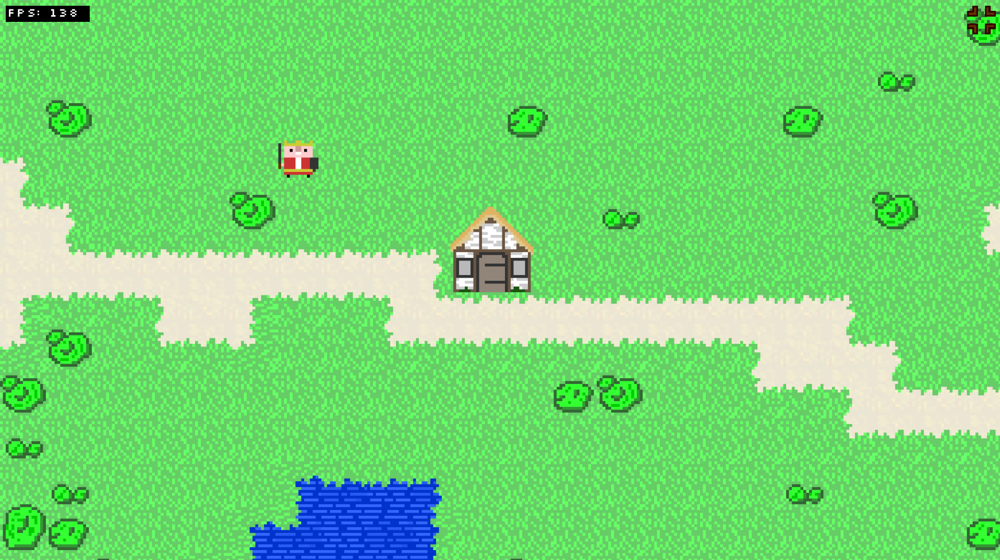

# 2D-Game-Engine
**Made by Jonas Karg 2018** 
A standalone 2D Game Engine based on JavaScript - mainly made for topdown browsergames 
But it can be configured for basically anyting. (e.g. a plattformer, etc..)

## Features:
- Load maps from 2 dimensional arrays with multiple texture-layers
- A collider
- A Movement system
- A animation system
- A character system

## An example game:
The plants, water, player and the sheep are animated. 

This library is opensource and can be used by anyone altough I'd appreciate a shoutout  :D 
**It is nowhere near to completion, so don't expect too much of it..**

